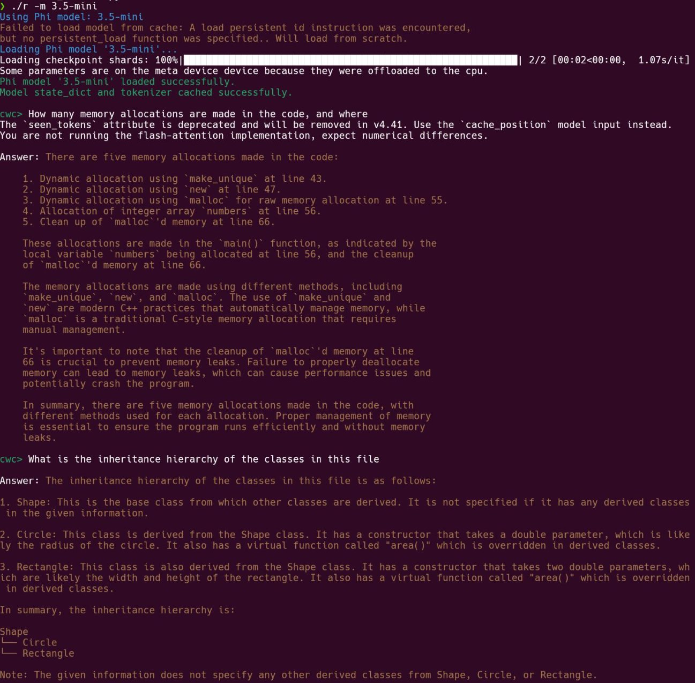

# C++ Code Analyzer with Phi Model
[](https://codeclimate.com/github/username/Cpp-AI-Repl)
[](https://opensource.org/licenses/MIT)

This project is a C++ code analysis tool that uses the Phi language model to provide insights and answer questions about C++ code.

## Features

- Analyzes C++ code structure and components
- Uses the Phi language model to answer questions about the analyzed code
- Supports various Phi model versions
- Provides a command-line interface for interaction

## Example Session

Here's a sample session with `cwc` as of September 2024:



## Requirements

- Python 3.7+
- PyTorch
- Transformers library
- Colorama
- NetworkX
- scikit-learn
- libclang
- CodeBERT

## Installation

1. Clone the repository:
   ```
   git clone https://github.com/yourusername/cpp-code-analyzer.git
   cd cpp-code-analyzer
   ```

2. Install the required dependencies:
   ```
   pip install torch transformers colorama networkx scikit-learn libclang
   ```

3. Ensure that libclang is properly installed and accessible in your system path.
    * run `bash setup.py`

## Usage

Run the main script with a C++ file as an argument:

```
python main.py path/to/your/cpp/file.cpp
```

You can specify a different Phi model using the `-m` or `--model` flag:

```
python main.py path/to/your/cpp/file.cpp -m 3.5-mini
```

Available models include:
- 3.5-mini
- 3.5-moe
- 3.5-vision
- 3-mini-4k
- (and others as listed in the `AVAILABLE_MODELS` dictionary)

## Interactive Mode

After loading a C++ file, you can interactively ask questions about the code:

```
cwc> What are the main classes in this file?
cwc> List all the methods in the Shape class
cwc> How many pure virtual functions are there in the code?
```

Type 'exit' to quit the interactive mode.

## Project Structure

- `main.py`: Entry point of the application
- `code_analyzer.py`: Contains the `CodeAnalyzer` class for parsing and analyzing C++ code
- `model_handler.py`: Handles loading and interacting with the Phi model
- `utils.py`: Utility functions for environment setup

## Troubleshooting

If you encounter issues with loading the model or analyzing code, ensure that:
- You have a stable internet connection for initial model download
- libclang is properly installed and configured
- You have sufficient disk space for model caching

## Contributing

Contributions are welcome! Please feel free to submit a Pull Request.

## License

MIT

## Acknowledgments

- This project uses the Phi model developed by Microsoft
- Thanks to the developers of PyTorch, Transformers, and other libraries used in this project

-------
# CodeBERT vs Phi-3.5 for C++ Code Analysis

## CodeBERT

1. **Purpose**: CodeBERT is specifically designed for programming language understanding tasks.
2. **Architecture**: Based on RoBERTa, a BERT variant optimized for code.
3. **Training**: Pre-trained on large-scale code repositories in multiple programming languages, including C++.
4. **Strengths**:
   - Strong at understanding code structure and semantics
   - Good at tasks like code search, clone detection, and code-to-text generation
5. **Limitations**:
   - Not designed for open-ended text generation
   - Limited context window (typically 512 tokens)

## Phi-3.5

1. **Purpose**: General-purpose language model with instruction-following capabilities.
2. **Architecture**: Based on the Transformer architecture, optimized for efficiency.
3. **Training**: Trained on a broad range of internet text, including some programming-related content.
4. **Strengths**:
   - Capable of generating human-like responses to open-ended questions
   - Can follow complex instructions and generate coherent, contextual responses
   - Larger context window (up to 128k tokens for some versions)
5. **Limitations**:
   - Not specifically optimized for code understanding
   - May sometimes generate plausible but incorrect code or explanations

## Working Together in Your Code

1. **Complementary Roles**:
   - CodeBERT provides a deep understanding of the code structure and semantics.
   - Phi-3.5 generates human-readable responses and explanations based on the code analysis.

2. **Integration Process**:
   - The code is first analyzed using the `CodeAnalyzer` class, which uses Clang to parse the C++ code and extract structural information.
   - This structural information is then processed by CodeBERT to generate embeddings that capture the code's semantic meaning.
   - The CodeBERT embeddings are combined with the user's question and fed into Phi-3.5.
   - Phi-3.5 uses this combined input to generate a response that leverages both the code understanding from CodeBERT and its own language generation capabilities.

3. **Specific Implementation**:
   - In the `generate_response` method of `ModelHandler`:
     - CodeBERT processes the input (which includes the code summary and user question) to generate embeddings.
     - These embeddings are concatenated with the Phi-3.5 input tokens.
     - Phi-3.5 then generates the final response based on this combined input.

This approach allows the system to leverage CodeBERT's specialized code understanding capabilities while utilizing Phi-3.5's more general language understanding and generation abilities to provide informative and contextually relevant responses to user queries about the C++ code.

-------

# C++ Code Analyzer Project Evaluation

## Overall Concept: 8/10
The project combines static code analysis with natural language processing, which is an innovative approach to understanding and querying C++ code. This combination can be particularly useful for developers and code reviewers.

## Architecture: 7/10
The project has a clear separation of concerns with distinct modules for code analysis, model handling, and utilities. However, there might be room for improvement in terms of extensibility and scalability.

## Code Quality: 7/10
The code appears well-structured and follows good practices such as:
- Use of classes and object-oriented design
- Error handling and informative error messages
- Use of type hinting in Python

Areas for improvement:
- More comprehensive error handling
- Better documentation (e.g., docstrings for functions and classes)

## Functionality: 8/10
The project offers a range of features:
- C++ code parsing and analysis
- Integration with multiple Phi model versions
- REPL interface for interactive querying
- Caching mechanism for improved performance

## Performance: 7/10
The use of caching for the Phi model is a good performance optimization. However, the performance of the code analysis part might be a concern for large codebases.

## Usability: 8/10
The REPL interface and the `r` script make the tool easy to use. The colorized output enhances readability.

## Extensibility: 6/10
While the project supports multiple Phi models, extending it to support other types of analysis or different language models might require significant changes.

## Security: 6/10
The project handles file I/O and executes code, which always poses some security risks. More robust input validation and sandboxing might be necessary.

## Testing: N/A
No explicit testing code is visible in the provided files. A comprehensive test suite would greatly enhance the project's reliability.

## Documentation: 6/10
While the code has some inline comments, more comprehensive documentation would be beneficial, especially for setup instructions and usage guidelines.

## Innovation: 8/10
The combination of static analysis and NLP for code understanding is innovative and has the potential to be a powerful developer tool.

## Areas for Improvement:
1. Implement a comprehensive test suite
2. Enhance documentation, including setup instructions and API docs
3. Consider adding support for more programming languages
4. Implement more advanced code analysis features (e.g., data flow analysis)
5. Optimize performance for larger codebases
6. Enhance security measures, especially when dealing with user-provided code

## Overall Score: 7.5/10
This project shows great potential as a tool for code analysis and understanding. With some refinements in testing, documentation, and extensibility, it could become a valuable asset for many development teams.


